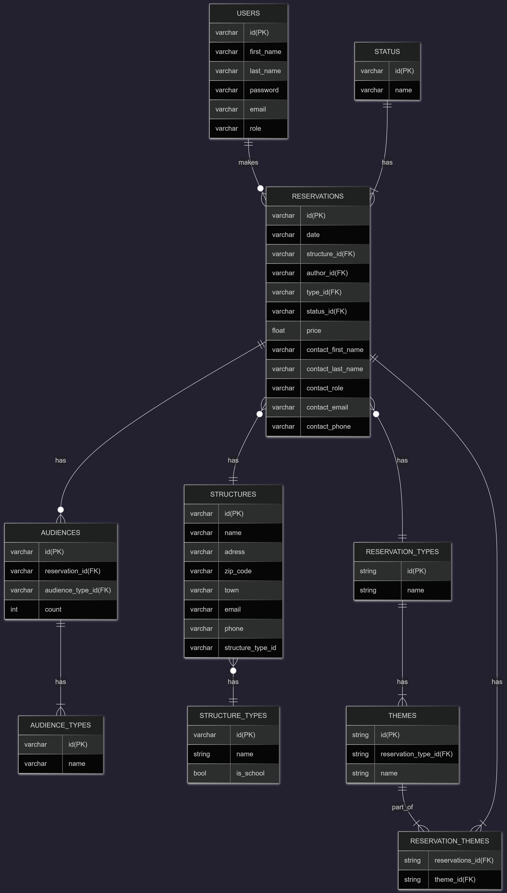

# PORTFOLIO PROJECT - HOLBERTON SCHOOL DIJON

This project is part the first-year "Fundamentals" curriculum at Holberton School.

We were asked to imagine, design and develop a web application of our choice.

This README describes **the different stages of my work** on this portfolio project, from `technical documentation` to code.
## NAVIGATION :
- [Introduction](#introduction-)
- [Technical documentation](#technical-documentation)
    - [Users stories](#users-stories)
    - [Mockups](#mockups)
    - [System architecture and technology stack](#system-architecture-and-technology-stack)
    - [Entities relationship diagram](#entities-relationship-diagram)
    - [Components - class diagram](#components---class-diagram)
    - [Sequences diagrams](#sequences-diagrams)
    - [Internal API documentation](#internal-api-documentation)
        - [Methods rules](#methods-rules-)
        - [Routes and authorizations](#routes-and-authorizations-)
        - [Data input and output format](#data-input-and-output-format-)
        - [Status code and messages](#status-codes-and-messages)
## INTRODUCTION :
### Purpose of the application:
This application offers an open-source solution for cultural organisations to manage their reservations.
### Problem statement:
Cultural organisations such as local museums and associations need sometimes some open-source or free-to-use solutions for economic reasons : they use several tools to manage their reservations, analyze their audiences, generate invoices...

This application aims to bring together three main features : 
- reservation scheduling, 
- automatic document generation based on scheduling information (contracts, invoices...),
- data extraction for reporting purpose,

## TECHNICAL DOCUMENTATION
### USERS STORIES
This section presents users stories so that we can imagine the app and define requirements from a user perspective.

 
Display users stories

Users stories describe what users can do within the application, and what they aim to achieve. They help understand their needs and  will guide the following steps in designing the application.

#### As a user I want to...

- `create a reservation` so that I can manage my activity *`Must have`*

- `register client's contact` information so that I can keep in contact with them all along the reservation process. *`Must have`*

- `register the activity information` (theme, price, audience) requested by the client, so that I can prepare the activity (animation, exhibition visit, etc.). *`Must have`*

- use reservation information to `generate an agreement`, so that I can formalize the reservation. *`Should have`*

- use reservation information to `generate a recap` for the client, so that the client and I have the same information of the reservation. *`Should have`*

- use reservation information to `generate an invoice`, so that I can be paid by the client after the service has been delivered.  *`Should have`*

- `track the reservation status`, so that I can know which work still needs to be done. *`Could have`*

- `extract my reservations` in a csv file so that I can analyze my audiences and my general activity.  *`Should have`*

#### As a manager, I want to...
- `view every reservation` of all users so I can have an overview of the activity.  *`Should have`*

- be able to `extract all the reservations` so I can produce an activity report for the organisation.  *`Should have`*

- `access every reservation : creation and update` so I can take action in case a collaborator is unavailable.  *`Should have`*

### MOCKUPS
This section provide few mockups to illustrate some main users stories.

Now we know what users and managers want to do and why, let's put those stories in pictures with mockups to get an overview of the user experience. 

### SYSTEM ARCHITECTURE AND TECHNOLOGY STACK

 Display architecture and technology details

</img>

This application follow a monolithic application three-tiers logic client-server architecture :
- <u>presentation layer</u> : a `front-end` interface allowing users to log in and create, update and view reservations;
- <u>business logic</u> : a `back-end` exposing a RESTful API that receive user queries from the front-end and apply business rules;
- <u>data and persistence layer</u> : a `relational database` used to store reservations, structures, reservation types, users, etc.;

#### Technology stack : 
-  <u>Front-end</u> :  
**HTML5, CSS3, JavaScript** 
Interface is built with `HTML5`, `CSS3` and `JavaScript` for interactivity and `client-side rendering`. 
Users access to data via HTTP requests through a RESTful API.

- <u>Back-end</u> : 
**Facade pattern, python, Flask RESTX API, ORM SQLAlchemy** 
Back-end is responsible for `business logic`. 
It exposes a `RESTful API` that receives user requests and returns data. 
A `Facade pattern` is used to process requests :  it orchestrates object creation and data storage making the code easier to maintain and update. 
`SQLAlchemy` will allow to manipulate data as objects, making requests safer and to focus on object-oriented paradigm.

- <u>Database</u> : 
**MySQL** 
Entities have strong relationships, that is why an SQL database is chosen. 
`SQLAlchemy ORM` is used by the back end to define models, manage database schema and perform queries. 
Since there is no need of extensibility, specific data types and no advanced features, `MySQL` is well suited for the project's requirements : easy to maintain, open-source, well documented, and well known by the developer team. 

### ENTITIES RELATIONSHIP DIAGRAM
Based on user needs identified in the user stories, this section present the entities, relationships and explains key design choices of the model.

Show entities relationship section

Since this application is about storing data on reservations, the ER diagram was designed first.

#### <u>Diagram</u> :
This diagram picture the general structure of the database tables and, attribute types, primary and foreign keys and relationships. 

[</img>]()
[Access to full view](https://www.mermaidchart.com/d/88b7aaa7-8f0f-4790-bf29-e7feb92990aa) 
[Access to Mermaid code](./Documentation_files/er_diagram_code.txt)

The reservation entity is central in the ER diagram and almost all its attributes are related to other entities. 

In order to understand the relationships between reservation and other entities, some clarifications might be needed on modeling decisions.

#### <u>Modeling decisions</u>:
The following points explain specific modeling decisions :

**Attributes**
- `users role`  User can be a manager or not.  A manager have access to specific CRUD operations (see [Internal API Documentation](#routes-and-authorizations-)).

- `reservation attributes "contact"`  Is not the structure contact but the contact of the specific person, from the structure, in charge of the reservation.  Sometimes, the contact from the structure is not the same person from a reservation to another.  Then, the contact is specific to the reservation.

**Relationships**
- `relationship users/reservation_types`  User can't create any type of reservation.  A list of reservation_types tels which type of reservation a user can manipulate.  Someone in charge of animation can't create reservation for an exhibition rental.

- `relationship themes/reservation_types`   Each kind of reservation_types have a specific list of themes.

**Entities**
- `reservation_types`  Are referring to the kind of activity booked : exhibition visit, outdoor animation, etc.

- `audiences_types, themes, reservation_types, structures_types`  Are needed to keep data consistency and integrity.  Types can be useful for reports. Having types entities avoids having the same value written in different ways.

#### <u>Relationships with reservation entity</u>:

Let's take a look at relationships with reservation entity.

Table | Relationship with reservation | Commentary
--|--|--|
USERS | 1-N | A reservation is authored by one user  A user can author zero or many reservations
STRUCTURES | 1-N | A reservation has one structure  A structure can do many reservations
RESERVATION_TYPES | 1-N | The structure must book one activity  An activity can be booked many times
THEMES | N-N | A structure can book many themes   A theme can be booked many times
AUDIENCES | 1-N | A reservation have several audiences ; and audience is a school level and a count of school children  An audience is unique to a reservation. 
STATUS | 1-N | A reservation got only one status, indicating at which step the reservation is  Many reservation use the same statuses.

### COMPONENTS - CLASS DIAGRAM

### SEQUENCES DIAGRAMS

### INTERNAL API DOCUMENTATION

This section explain the application API rules, the routes and methods allowed, the status codes and the input and output formats for the main classes.

Show API Documentation

#### <u>Methods rules </u>:
- **POST**   Allows resource creation, a data input is required;
- **GET**  Allows resource retrieval.  A specific resource can be retrieved if route allow `path parameter` - otherwise, all resources are retrieved;
- **PUT**  Allows resource update ; a data input is required and `path parameter` is necessary to specify which resource to update;
- **DELETE**  
`Delete methods are not allowed` to keep data integrity and historical consistency.  Instead, resources will be marked as `inactive`;

#### <u>Routes and authorizations</u> :
**Users** can create `reservations` and `themes` in reservation types they are allowed to. 
They can create, update and retrieve `structures`. 
They can `access reservations` they authored.  
They can create and modify `audiences` to their reservations.

**Manager** can `access all resources`. 
They are the only ones that can perform `types` (reservation, audience, structure) and `status` creation and update. 

`Some routes might need to be refactored, as certain resources can be better represented as sub-resources.`

Route | Methods allowed | Path parameter | Authorizations | Action
|--|--|--|--|--|
`/login` | **POST** | / | - No authorizations needed | Gives access token to user if authentication success
`/user` | **POST** **PUT** **GET** |  user_id | - Manager role required | User(s) management
`/reservations` | **POST** **PUT** **GET** | reservation_id | - Reservation type authorization required  -Author authorization - Manager role | Manage reservations
`/reservation_types` | **POST** **PUT** **GET** | type_id | - Manager role for POST and PUT  - Authentication for GET | Manager reservation types
`/structures` | **POST** **PUT** **GET** | structure_id  | - Authentication needed | Manage structres
`/structure_types` | **POST** **PUT** **GET** | structure_id | - Manager role for POST and PUT  - Authentication for GET | Manage structure types
`/themes` | **POST** **PUT** **GET** | theme_id | - Reservation type authorization  - Manager role | Manage themes
`/audience` | **POST** **PUT** **GET** | reservation_id ? | - Reservation's author authorization  - Manager role | Manage audiences
`/audience_types` | **POST** **PUT** **GET** | type_id | - Manager role for POST and PUT  - Authentication for GET | Manage audience types

#### <u>Data input and output format</u> :

Input and output data is in `JSON` format. 

To perform **POST** and **PUT** request, you can refer to the attribute shown in the [`class diagram`](#components---class-diagram). 

#### <u>Status codes and messages</u>:

Status code | Message | Meaning |
|--|--|--|
200 | OK | Resource successfully retrieved  `GET method` | 
201 | Created | Resource successfully created  `POST method`|
400 | Invalid input | Some data in the input are not in the expected format  `POST method`
401 | Invalid credentials | Wrong credentials registered while logging in  `POST method` *on login route* 
403 | Unauthorized action | User tried to access a route he is not allowed to 
404 | Resource not found | User tried to access a specific resource, but it can't be found  `PUT method`  `GET method`

