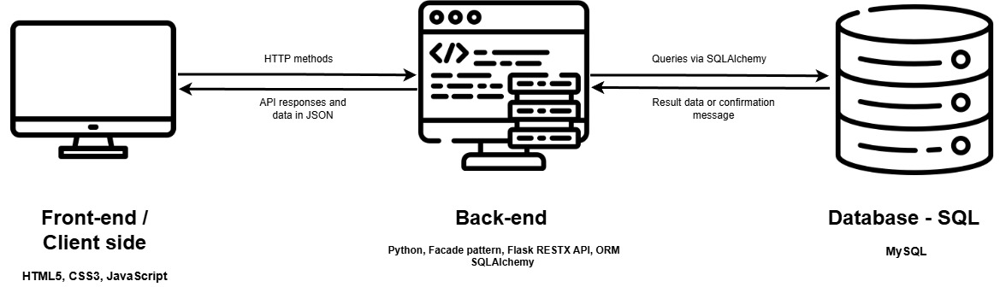

# PORTFOLIO PROJECT - HOLBERTON SCHOOL DIJON

This project is part the first year "Fundamentals" curriculum at Holberton School.

We were asked to imagine, design and develop a web application of our choice and to develop it.

This README describes **the different stages of my work** on this portfolio project, from `technical documentation` to code.

## INTRODUCTION :
### Purpose of the application:
This application offers an open-source solution for cultural organisations to manage their bookings.
### Problem statement:
Cultural organisations such as local museums and associations need sometimes some open-source or free-to-use solutions for economic reasons : they use several tools to manage their booking, analyze their audiences, generate invoices...

This application aims to bring together three main features : 
- booking scheduling, 
- automatic document generation based on scheduling information (contracts, invoices...),
- data extraction for reporting purpose,

## TECHNICAL DOCUMENTATION
### USERS STORIES
This section present users stories so that we can imagine the app and define requirements from a user perspective.

 
Display users stories

#### As a user I want to...

- `create a booking` so that I can manage my activity

- `register client's contact` information so that I can keep in contact with them all along the booking process.

- `register the activity information` (theme, price, audience) requested by the client, so that I can prepare the activity (animation, exhibition visit, etc.).

- use booking information to `generate an agreement`, so that I can formalize the booking.

- use booking information to `generate a recap` for the client, so that the client and I have the same information of the booking.

- use booking of the information to `generate an invoice`, so that I can be paid by the client after the service has been delivered. 

- `track the booking status`, so that I can know which work still need to be done.

- `extract my bookings` in a csv file so that I can analyze my audiences and my general activity. 

#### As a manager, I want to...
- `view every booking` of all users so I can have an overview of the activity.

- be able to `extract all the bookings` sur I can produce an activity report for the organisation.

- `access every booking : creation and update` so I can take action in case a collaborator is unavailable.

### MOCKUPS
This section offer few mockups to illustrate some major users stories.

### SYSTEM ARCHITECTURE AND TECHNOLOGY STACK

 Display architecture and technology details

</img>

This application follow a monolithic application three-tiers client-server logic architecture :
- <u>presentation layer</u> : a `front-end` interface allowing users to log in and create, update and view bookings;
- <u>business logic</u> : a `back-end` exposing a RESTful API that receive user queries from the front-end and apply business rules;
- <u>data an persistence layer</u> : a `relational database` used to store bookings, structures, booking types, users, etc.;

#### Technology stack : 
-  <u>Front-end</u> :  
**HTML5, CSS3, JavaScript** 
Interface is built with `HTML5`, `CSS3` and `JavaScript` for interactivity and `client-side rendering`. 
Users access to data via HTTP requests through a RESTful API.

- <u>Back-end</u> : 
**Facade pattern, python, Flask RESTX API, ORM SQLAlchemy** 
Back-end is responsible of `business logic`. 
It exposes a `RESTful API` that receives user requests and returns data. 
A `Facade pattern` is used to process requests :  it orchestrates object creation and data storage making the code easier to maintain and update. 
`SQLAlchemy` will allow to manipulate data as objects, making requests safer and to focus on object-oriented paradigm.

- <u>Database</u> : 
**MySQL** 
Entities have strong relationships, that is why an SQL database is chosen. 
`SQLAlchemy ORM` is used by the back end to define models, manage database schema and perform queries. 
Since there is no need of extensibility, specific data types and no advanced features, `MySQL` is well suited for the project's requirements : easy to maintain, open-source, well documented, and well known by the developer team. 

### ENTITIES RELATIONSHIP DIAGRAM

### COMPONENTS - CLASS DIAGRAM

### SEQUENCES DIAGRAMS

### INTERNAL API DOCUMENTATION

This section shows the details of the RESTful API with:
- a list of routes, 
- methods allowed for each route,
- data format for POST methods,
- data format returned,
- status codes and messages,

This documentation helps identify possible error cases and understand how to interact with the API.

Just a quick reminder :
- POST methods are for ressource creation
- GET methods are for ressource retrieval
- PUT methods are for ressource update
- DELETE methods are fore ressource deletion

ROUTE | Methods | Input (POST and PUT) | Output | JWT Protected ?
--|--|--|--|--|
`/login` | **POST** | {"email" : "\<email>", "password" : "\<password>"} | 200 OK, {"access_token" : <access_token>} 401, {"error" : "invalid credentials"} | ✘
`/reservation` | **POST** | {"structure": "\<structure_id>", "author": "\<user_id>", "date": "\<date>", "status": "\<status>", "contact": {"first_name": "\<name>", "last_name": "\<name>", "role": "\<role>", "email": "\<email>", "phone": "\<phone>"}, "price": "\<price>", "type": "\<reservationtype_id>"} | 201, Created 400, {"error" : "Invalid input"} 403, {"error" : "Unauthorized action"} | **✓**
`/reservation` | **GET** | / | 200, OK 403, {"error" : "Unauthorized action"} | **✓**
`/reservation/<reservation_id>` |  **GET**  |/  | 200, OK 403, {"error" : "Unauthorized action"} 404 {"error" : "Reservation id not found"} | **✓**
`/reservation/<reservation_id>` | **PUT** | {"structure": "\<structure_id>", "author": "\<user_id>", "date": "\<date>", "status": "\<status>", "contact": {"first_name": "\<name>", "last_name": "\<name>", "role": "\<role>", "email": "\<email>", "phone": "\<phone>"}, "price": "\<price>", "type": "\<reservationtype_id>"} | 200, OK 403, {"error" : "Unauthorized action"} 404 {"error" : "Reservation id not found"} | **✓**

